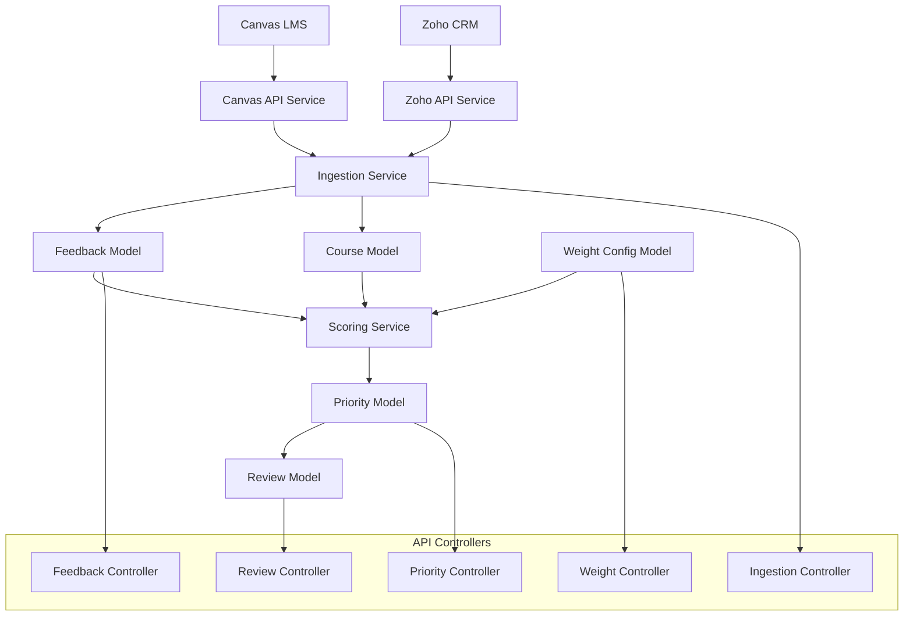

# Course Feedback Aggregator - API Documentation

## API Overview

The Course Feedback Aggregator API provides a RESTful interface for managing course feedback data, generating explainable priority recommendations, and tracking review workflows.

**Base URL**: `https://coursefeedback-api.railway.app/api/v1`  
**Authentication**: API Key (for admin endpoints)  
**Response Format**: JSON  
**API Version**: 1.0.0

## Data Flow Relationships



## Core API Endpoints

### Health & Status
```http
GET /api/v1/health
```
**Description**: Service health check  
**Authentication**: None  
**Response**:
```json
{
  "status": "healthy",
  "timestamp": "2025-09-10T12:00:00Z",
  "database": "connected",
  "version": "1.0.0"
}
```

---

### Feedback Management

#### List All Feedback
```http
GET /api/v1/feedback
```
**Query Parameters**:
- `course_id` (optional): Filter by course
- `source` (optional): Filter by source (canvas|zoho)
- `severity` (optional): Filter by severity level
- `limit` (optional): Number of results (default: 50)
- `offset` (optional): Pagination offset

**Response**:
```json
{
  "success": true,
  "data": [
    {
      "id": 123,
      "course_id": "canvas_847",
      "course_name": "IT Leadership Certificate",
      "student_email": "student@example.com",
      "feedback_text": "Video quality is poor in Module 2",
      "rating": 2.5,
      "severity": "high",
      "source": "canvas",
      "source_id": "discussion_post_456",
      "created_at": "2025-09-01T10:30:00Z"
    }
  ],
  "pagination": {
    "total": 150,
    "limit": 50,
    "offset": 0,
    "has_next": true
  }
}
```

#### Create Feedback Entry
```http
POST /api/v1/feedback
```
**Request Body**:
```json
{
  "course_id": "canvas_847",
  "course_name": "IT Leadership Certificate",
  "student_email": "student@example.com",
  "feedback_text": "The quiz instructions are unclear",
  "rating": 3.0,
  "severity": "medium",
  "source": "canvas",
  "source_id": "quiz_submission_789"
}
```

#### Get Specific Feedback
```http
GET /api/v1/feedback/{id}
```
**Response**: Single feedback object with full details

---

### Priority Management

#### List Priority Recommendations
```http
GET /api/v1/priorities
```
**Query Parameters**:
- `course_id` (optional): Filter by course
- `min_score` (optional): Minimum priority score
- `order_by` (optional): Sort order (score|created_at|updated_at)

**Response**:
```json
{
  "success": true,
  "data": [
    {
      "id": 456,
      "course_id": "canvas_847",
      "issue_summary": "Video quality issues affecting student comprehension",
      "priority_score": 8,
      "scoring_breakdown": {
        "impact_score": 9.2,
        "urgency_score": 8.5,
        "effort_score": 6.0,
        "strategic_score": 7.0,
        "trend_score": 8.0,
        "weights_used": {
          "impact_weight": 0.40,
          "urgency_weight": 0.35,
          "effort_weight": 0.25,
          "strategic_weight": 0.15,
          "trend_weight": 0.10
        }
      },
      "students_affected": 23,
      "evidence": {
        "student_quotes": [
          {
            "feedback_id": 123,
            "quote": "Video quality is poor and hard to follow",
            "source": "canvas",
            "source_id": "discussion_post_456"
          }
        ],
        "source_links": [
          {
            "platform": "canvas",
            "url": "https://canvas.../courses/847/discussion_topics/456",
            "description": "Original discussion thread"
          }
        ],
        "confidence_score": 0.85
      },
      "feedback_ids": [123, 124, 125],
      "created_at": "2025-09-10T08:00:00Z",
      "updated_at": "2025-09-10T09:15:00Z"
    }
  ]
}
```

#### Trigger Priority Recalculation
```http
POST /api/v1/priorities/recompute
```
**Request Body**:
```json
{
  "course_ids": ["canvas_847", "zoho_ai_program"],  // Optional: specific courses
  "force_refresh": true  // Optional: recalculate even if recent
}
```

#### Get Specific Priority
```http
GET /api/v1/priorities/{id}
```
**Response**: Single priority with full scoring breakdown and evidence

#### Submit Priority Review
```http
POST /api/v1/priorities/{id}/review
```
**Request Body**:
```json
{
  "reviewer_name": "Dr. Sarah Johnson",
  "validated": true,
  "action_taken": "implemented",
  "notes": "Video quality has been upgraded. Issue resolved."
}
```

---

### Weight Configuration

#### Get Active Weight Configuration
```http
GET /api/v1/weights
```
**Response**:
```json
{
  "success": true,
  "data": {
    "id": 1,
    "impact_weight": 0.40,
    "urgency_weight": 0.35,
    "effort_weight": 0.25,
    "strategic_weight": 0.15,
    "trend_weight": 0.10,
    "updated_at": "2025-09-10T12:00:00Z",
    "updated_by": "admin@example.com",
    "is_active": true
  }
}
```

#### Update Weight Configuration
```http
PUT /api/v1/weights
```
**Request Body**:
```json
{
  "impact_weight": 0.45,
  "urgency_weight": 0.30,
  "effort_weight": 0.25,
  "strategic_weight": 0.15,
  "trend_weight": 0.10,
  "updated_by": "admin@example.com"
}
```

#### Get Weight Change History
```http
GET /api/v1/weights/history
```
**Response**: Array of previous weight configurations with change timestamps

---

### Data Ingestion

#### Trigger Canvas Data Ingestion
```http
POST /api/v1/ingest/canvas
```
**Request Body**:
```json
{
  "course_ids": [847, 852],  // Optional: specific Canvas course IDs
  "max_courses": 10,         // Optional: limit processing
  "include_analytics": true  // Optional: include course analytics
}
```
**Response**:
```json
{
  "success": true,
  "data": {
    "job_id": "ingest_canvas_20250910_120000",
    "status": "processing",
    "courses_queued": 10,
    "estimated_completion": "2025-09-10T12:15:00Z"
  }
}
```

#### Trigger Zoho Data Ingestion
```http
POST /api/v1/ingest/zoho
```
**Request Body**:
```json
{
  "module": "Deals",           // Zoho module to sync
  "date_range": "last_30_days", // Optional: filter by date
  "include_surveys": true      // Optional: include survey responses
}
```

#### Get Ingestion Status
```http
GET /api/v1/ingest/status/{job_id}
```
**Response**:
```json
{
  "success": true,
  "data": {
    "job_id": "ingest_canvas_20250910_120000",
    "status": "completed",
    "progress": {
      "courses_processed": 10,
      "feedback_items_created": 245,
      "priorities_generated": 15,
      "errors": 0
    },
    "started_at": "2025-09-10T12:00:00Z",
    "completed_at": "2025-09-10T12:12:34Z",
    "results_summary": {
      "new_feedback_count": 245,
      "updated_feedback_count": 12,
      "urgent_issues_identified": 3
    }
  }
}
```

---

### Course Management

#### List Courses
```http
GET /api/v1/courses
```
**Query Parameters**:
- `status` (optional): Filter by status (active|completed|archived)
- `has_feedback` (optional): Only courses with feedback

**Response**:
```json
{
  "success": true,
  "data": [
    {
      "course_id": "canvas_847",
      "course_name": "IT Leadership Certificate",
      "instructor_name": "Dr. Sarah Johnson",
      "canvas_id": "847",
      "zoho_program_id": null,
      "start_date": "2025-08-01",
      "end_date": "2025-10-01",
      "status": "active",
      "feedback_count": 45,
      "priority_count": 8,
      "urgent_issues": 2
    }
  ]
}
```

#### Get Course Analytics
```http
GET /api/v1/courses/{course_id}/analytics
```
**Response**:
```json
{
  "success": true,
  "data": {
    "course_id": "canvas_847",
    "analytics_summary": {
      "total_feedback": 45,
      "average_rating": 4.2,
      "feedback_sources": {
        "canvas": 38,
        "zoho": 7
      },
      "severity_distribution": {
        "critical": 2,
        "high": 8,
        "medium": 20,
        "low": 15
      },
      "top_issues": [
        {
          "category": "technical_issues",
          "count": 12,
          "percentage": 26.7
        }
      ],
      "student_engagement": {
        "total_students": 35,
        "feedback_participation_rate": 0.85,
        "average_feedback_per_student": 1.3
      }
    }
  }
}
```

---

## Error Handling

### Standard Error Response
```json
{
  "success": false,
  "error": {
    "code": "VALIDATION_ERROR",
    "message": "Invalid course_id format",
    "details": {
      "field": "course_id",
      "expected_format": "source_id (e.g., canvas_847)"
    }
  },
  "timestamp": "2025-09-10T12:00:00Z"
}
```

### Error Codes
- `400` - Bad Request (validation errors)
- `401` - Unauthorized (missing/invalid API key)
- `403` - Forbidden (insufficient permissions)
- `404` - Not Found (resource doesn't exist)
- `422` - Unprocessable Entity (business logic errors)
- `429` - Too Many Requests (rate limiting)
- `500` - Internal Server Error

## Rate Limiting

- **Standard Endpoints**: 100 requests per 10 minutes per IP
- **Ingestion Endpoints**: 10 requests per hour per API key
- **Headers Included**:
  ```
  X-RateLimit-Limit: 100
  X-RateLimit-Remaining: 95
  X-RateLimit-Reset: 1694361600
  ```

## Authentication

### API Key Authentication (Admin Endpoints)
```http
Authorization: Bearer {api_key}
```

**Admin Endpoints**:
- `POST /api/v1/ingest/*`
- `PUT /api/v1/weights`
- `POST /api/v1/priorities/{id}/review`

### Public Endpoints (No Authentication)
- `GET /api/v1/health`
- `GET /api/v1/feedback`
- `GET /api/v1/priorities`
- `GET /api/v1/courses`
- `GET /api/v1/weights`

## Data Validation

### Feedback Validation
- `course_id`: Required, format: `source_courseId`
- `source`: Required, enum: [`canvas`, `zoho`]
- `rating`: Optional, range: 1.0-5.0
- `severity`: Optional, enum: [`critical`, `high`, `medium`, `low`]

### Priority Validation
- All score fields: Range 1.0-5.0
- `priority_score`: Range 1-5 (integer)
- `students_affected`: Non-negative integer

### Weight Configuration Validation
- All weights must sum to 1.0 (±0.01 tolerance)
- Individual weights: Range 0.0-1.0
- At least one weight must be > 0.0

This API provides comprehensive access to the Course Feedback Aggregator system with full CRUD operations, explainable AI recommendations, and robust data validation.