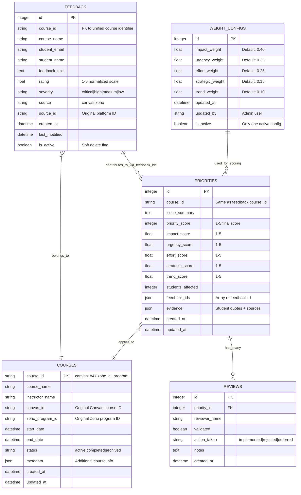
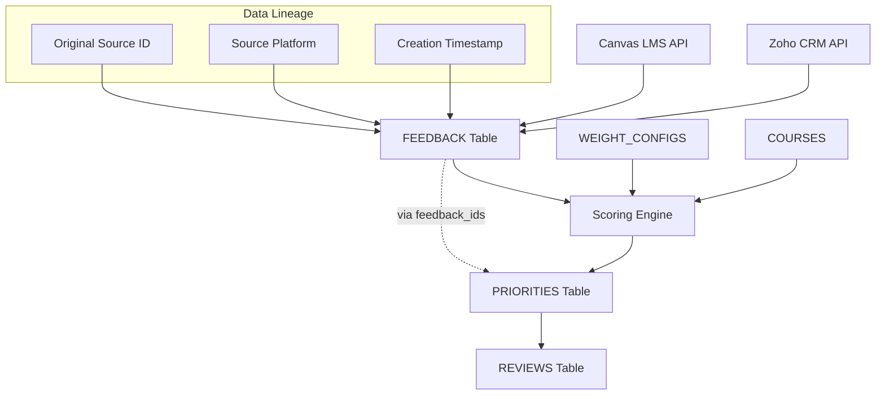

# Course Feedback Aggregator - Database Schema Documentation

## Database Architecture Overview

The Course Feedback Aggregator uses a **PostgreSQL database** hosted on **Neon** with a unified schema that consolidates feedback from Canvas LMS and Zoho CRM into a single prioritization and tracking system.

## Entity Relationship Diagram (ERD)



## Table Specifications

### 1. **FEEDBACK** - Unified feedback storage
**Purpose**: Central repository for all student feedback from Canvas and Zoho

| Column | Type | Constraints | Description |
|--------|------|-------------|-------------|
| `id` | INTEGER | PRIMARY KEY, AUTO_INCREMENT | Unique feedback identifier |
| `course_id` | VARCHAR(50) | NOT NULL, INDEX | Unified course identifier |
| `course_name` | VARCHAR(255) | NOT NULL | Full course title |
| `student_email` | VARCHAR(255) | NULL | Student identifier (anonymizable) |
| `student_name` | VARCHAR(255) | NULL | Student name (anonymizable) |
| `feedback_text` | TEXT | NULL | Raw feedback content |
| `rating` | FLOAT | NULL | 1-5 normalized rating |
| `severity` | VARCHAR(20) | NULL | critical\|high\|medium\|low |
| `source` | VARCHAR(10) | NOT NULL, INDEX | canvas\|zoho |
| `source_id` | VARCHAR(100) | NULL | Original platform ID for traceability |
| `created_at` | TIMESTAMP | DEFAULT NOW() | Original feedback timestamp |
| `last_modified` | TIMESTAMP | DEFAULT NOW() | Last update timestamp |
| `is_active` | BOOLEAN | DEFAULT TRUE | Soft delete flag |

**Indexes:**
- `idx_feedback_course_id` on `course_id`
- `idx_feedback_source` on `source`
- `idx_feedback_severity` on `severity`
- `idx_feedback_created_at` on `created_at`

### 2. **PRIORITIES** - AI-generated recommendations
**Purpose**: Computed priority recommendations with explainable scoring

| Column | Type | Constraints | Description |
|--------|------|-------------|-------------|
| `id` | INTEGER | PRIMARY KEY, AUTO_INCREMENT | Unique priority ID |
| `course_id` | VARCHAR(50) | NOT NULL, INDEX | Course identifier |
| `issue_summary` | TEXT | NOT NULL | AI-generated issue description |
| `priority_score` | INTEGER | NOT NULL | 1-5 final priority score |
| `impact_score` | FLOAT | NOT NULL | Student impact factor (1-5) |
| `urgency_score` | FLOAT | NOT NULL | Time-sensitivity factor (1-5) |
| `effort_score` | FLOAT | NOT NULL | Implementation effort (1-5) |
| `strategic_score` | FLOAT | DEFAULT 3.0 | Strategic alignment (1-5) |
| `trend_score` | FLOAT | DEFAULT 3.0 | Issue trajectory (1-5) |
| `students_affected` | INTEGER | DEFAULT 0 | Count of affected students |
| `feedback_ids` | JSON | NULL | Array of source feedback IDs |
| `evidence` | JSON | NULL | Student quotes and source links |
| `created_at` | TIMESTAMP | DEFAULT NOW() | Priority creation time |
| `updated_at` | TIMESTAMP | DEFAULT NOW() | Last recalculation time |

**Indexes:**
- `idx_priorities_course_id` on `course_id`
- `idx_priorities_score` on `priority_score`
- `idx_priorities_updated` on `updated_at`

### 3. **WEIGHT_CONFIGS** - Tunable scoring parameters
**Purpose**: Admin-configurable weights for priority scoring algorithm

| Column | Type | Constraints | Description |
|--------|------|-------------|-------------|
| `id` | INTEGER | PRIMARY KEY, AUTO_INCREMENT | Configuration ID |
| `impact_weight` | FLOAT | NOT NULL, DEFAULT 0.40 | Impact factor weight (40%) |
| `urgency_weight` | FLOAT | NOT NULL, DEFAULT 0.35 | Urgency factor weight (35%) |
| `effort_weight` | FLOAT | NOT NULL, DEFAULT 0.25 | Effort factor weight (25%) |
| `strategic_weight` | FLOAT | NOT NULL, DEFAULT 0.15 | Strategic factor weight (15%) |
| `trend_weight` | FLOAT | NOT NULL, DEFAULT 0.10 | Trend factor weight (10%) |
| `updated_at` | TIMESTAMP | DEFAULT NOW() | Configuration change time |
| `updated_by` | VARCHAR(255) | NULL | Admin who made changes |
| `is_active` | BOOLEAN | DEFAULT TRUE | Only one active config |

**Business Rule**: Only one `is_active=TRUE` record allowed at any time.

### 4. **REVIEWS** - Human validation workflow
**Purpose**: Track admin review and validation of AI recommendations

| Column | Type | Constraints | Description |
|--------|------|-------------|-------------|
| `id` | INTEGER | PRIMARY KEY, AUTO_INCREMENT | Review ID |
| `priority_id` | INTEGER | NOT NULL, FK | Reference to priority |
| `reviewer_name` | VARCHAR(255) | NOT NULL | Admin reviewer name |
| `validated` | BOOLEAN | DEFAULT FALSE | Approval status |
| `action_taken` | VARCHAR(50) | NULL | implemented\|rejected\|deferred |
| `notes` | TEXT | NULL | Reviewer comments |
| `created_at` | TIMESTAMP | DEFAULT NOW() | Review timestamp |

**Foreign Keys:**
- `priority_id` → `priorities.id` (CASCADE DELETE)

### 5. **COURSES** - Course metadata and mapping
**Purpose**: Unified course information with Canvas/Zoho ID mapping

| Column | Type | Constraints | Description |
|--------|------|-------------|-------------|
| `course_id` | VARCHAR(50) | PRIMARY KEY | Unified course identifier |
| `course_name` | VARCHAR(255) | NOT NULL | Full course title |
| `instructor_name` | VARCHAR(255) | NULL | Primary instructor |
| `canvas_id` | VARCHAR(100) | NULL | Original Canvas course ID |
| `zoho_program_id` | VARCHAR(100) | NULL | Original Zoho program ID |
| `start_date` | DATE | NULL | Course start date |
| `end_date` | DATE | NULL | Course end date |
| `status` | VARCHAR(20) | DEFAULT 'active' | active\|completed\|archived |
| `metadata` | JSON | NULL | Additional course information |
| `created_at` | TIMESTAMP | DEFAULT NOW() | Record creation |
| `updated_at` | TIMESTAMP | DEFAULT NOW() | Last update |

**Unique Constraints:**
- `canvas_id` (if not NULL)
- `zoho_program_id` (if not NULL)

## Data Relationships

### 1. **One-to-Many Relationships**
- **COURSES → FEEDBACK**: One course has many feedback entries
- **COURSES → PRIORITIES**: One course has many priority recommendations  
- **PRIORITIES → REVIEWS**: One priority can have multiple reviews

### 2. **Many-to-Many Relationships (via JSON)**
- **FEEDBACK ↔ PRIORITIES**: Multiple feedback items contribute to one priority (via `feedback_ids` JSON array)

### 3. **Configuration Relationships**
- **WEIGHT_CONFIGS → PRIORITIES**: Active weight config used for all priority calculations

## Data Flow and Provenance



## Scoring Algorithm Integration

### Priority Score Calculation
```sql
priority_score = ROUND(
    (impact_score * impact_weight) +
    (urgency_score * urgency_weight) + 
    (effort_score * effort_weight) +
    (strategic_score * strategic_weight) +
    (trend_score * trend_weight)
)
```

### Evidence Tracking
```json
{
  "evidence": {
    "student_quotes": [
      {
        "feedback_id": 123,
        "quote": "The video quality is poor and hard to follow",
        "source": "canvas",
        "source_id": "discussion_post_456"
      }
    ],
    "source_links": [
      {
        "platform": "canvas", 
        "url": "https://canvas.../courses/847/discussion_topics/456",
        "description": "Original discussion thread"
      }
    ],
    "affected_students": 23,
    "confidence_score": 0.85
  }
}
```

## Database Constraints and Business Rules

### 1. **Data Integrity**
- All feedback must have `course_id` and `source`
- Priority scores must be between 1-5
- Only one active weight configuration allowed
- Soft deletes via `is_active` flag

### 2. **Audit Trail**
- All tables include creation timestamps
- Updates tracked via `updated_at` fields  
- Original source IDs preserved for traceability
- Admin actions logged in `updated_by` fields

### 3. **Performance Optimization**
- Strategic indexes on frequently queried columns
- JSON columns for flexible metadata storage
- Connection pooling for async operations

## Migration Strategy

### Phase 1: Schema Creation
```sql
-- Create tables in dependency order
1. WEIGHT_CONFIGS (no dependencies)
2. COURSES (no dependencies)  
3. FEEDBACK (depends on COURSES)
4. PRIORITIES (depends on COURSES)
5. REVIEWS (depends on PRIORITIES)
```

### Phase 2: Default Data
```sql
-- Insert default weight configuration
INSERT INTO weight_configs (
    impact_weight, urgency_weight, effort_weight,
    strategic_weight, trend_weight, 
    updated_by, is_active
) VALUES (0.40, 0.35, 0.25, 0.15, 0.10, 'system', TRUE);
```

### Phase 3: Data Migration
- Import existing mock data
- Map Canvas course IDs to unified format
- Backfill course metadata from APIs

This schema provides a solid foundation for explainable AI recommendations with full data provenance and admin oversight capabilities.